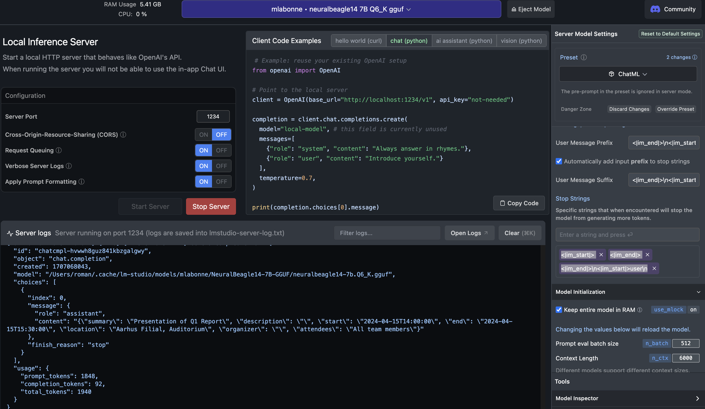
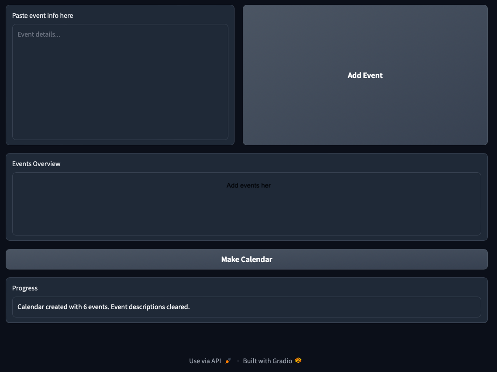

# Local LLM - Event Calendar Parser Demo

## Overview

This application is designed to parse event descriptions into structured calendar entries. It uses a local language model (LLM) to process unstructured text into a structured JSON format, which is then converted into calendar events. These events are compiled into an .ics file, creating a comprehensive calendar. It can then be added to standard calendar software like Outlook. The application is built with Python and utilizes Gradio for its web interface, allowing users to input event descriptions and generate calendars through a browser. That's just a demo of automation with local LLMs and not a real-world application.

## Getting Started

### Prerequisites

- Python 3.11
- [LM Studio](https://lmstudio.ai) and a suitable language model running on localhost `http://localhost:1234/v1`
- Gradio
- `icalendar`, `pytz`, `dateutil`, `openai`, `json`, `os`, and `argparse` Python libraries

### Installation

1. Clone the repository:
   ```
   git clone https://github.com/RJuro/local-llm-calendar.git
   ```

2. Install the required Python packages:
   ```
   pip install -r requirements.txt
   ```

### Setting Up the Language Model

Run LM Studio with a suitable local model, such as:
- [mlabonne/NeuralBeagle14-7B-GGUF](https://huggingface.co/mlabonne/NeuralBeagle14-7B-GGUF)
- [RJuro/munin-neuralbeagle-7b-GGUF](https://huggingface.co/RJuro/munin-neuralbeagle-7b-GGUF)

In [LM Studio](https://lmstudio.ai), use the ChatML template and add the following stop tokens for the setup: ```<|im_start|>
<|im_end|>
<|im_end|>\n<|im_start|>user\n```. This is necessary because merged models like those above tend to overgenerate and require explicit stop-sequences.

### Starting the Local Inference Server

Start the [LM Studio](https://lmstudio.ai) Local Inference Server that emulates OpenAI's API behavior:
```
# Command to start the server (specific to your setup)
```



### Running the Application

To run the application, use the following command (optionally specifying `--port 8000`):
```
python calparse.py --start-server
```

## Usage



1. Open the Gradio app in your web browser.
2. Add event descriptions in the provided textbox. You can use examples provided below or create your own.
3. Click "Add Event" to store the event description temporarily.
4. Once all events are added, click "Make Calendar" to compile the events into a calendar file (.ics).
5. Download the generated calendar file and import it into your calendar application of choice.

## Examples of Event Descriptions

### Danish
- "Møde om projektplanlægning d. 12. marts 2024 fra kl. 09:00 til 11:00. Sted: København, Hovedkontoret, Mødelokale 3B. Deltagerne inkluderer afdelingslederne og projektteamet."
- "Præsentation af kvartalsrapporten, 15. april 2024, start kl. 14:00, slutter 15:30. Afholdes i auditoriet på Aarhus filialen. Obligatorisk for alle teammedlemmer."

### German
- "Workshop zur Digitalisierung der internen Prozesse am 20. Februar 2024, Beginn um 10 Uhr, Ende um 16 Uhr. Ort: München, Technologiepark Innovationszentrum, Raum A2."
- "Vorstellung neuer Mitarbeiter, am 5. März 2024, von 13:00 bis 14:00 Uhr, im Konferenzraum 4 der Zentrale in Berlin. Einladung an alle Abteilungsleiter."

### English
- "Board meeting to discuss annual budget, March 10th, 2024, from 9 AM to 12 PM. Location: London Office, Conference Room 1. Attendance required for all board members."
- "Team building activity scheduled for April 22nd, 2024. Starts at 8:30 AM and ends at 5:30 PM. To be held at the Retreat Center, Lakeview Park. RSVP to HR by March 31st."

This README provides a basic guide to setting up and using the Event Calendar Parser Application. Adjustments may be necessary based on your specific setup and requirements.